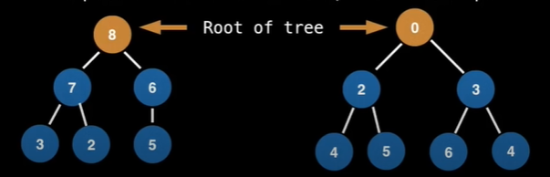

# Data Structures Easy to Advanced Course

## Additional resources

- William Fiset's Github: <https://github.com/williamfiset>
- GitHub with .py code for some of the Data Structures: <https://github.com/akzare/Algorithms>
- YT link: <https://www.youtube.com/watch?v=RBSGKlAvoiM>

1. Dynamic & Static Array
2. Linked & Doubly Linked List
3. Stack
4. Queue
5. Priority Queue
6. Union find
7. Binary Search
8. Hash Table
9. Fenwick Tree

## Table of contents

01. Abstract data types
02. Introduction to Big-O
03. Dynamic and Static Arrays
04. Dynamic Array Code
05. Linked Lists Introduction
06. Doubly Linked List Code
07. Stack Introduction
08. Stack Implementation
09. Stack Code
10. Queue Introduction
11. Queue Implementation
12. Queue Code
13. Priority Queue Introduction
14. Priority Queue Min Heaps and Max Heaps
15. Priority Queue Inserting Elements
16. Priority Queue Removing Elements
17. Priority Queue Code
18. Union Find Introduction
19. Union Find Kruskal's Algorithm
20. Union Find - Union and Find Operations
21. Union Find Path Compression
22. Union Find Code
23. Binary Search Tree Introduction
24. Binary Search Tree Insertion
25. Binary Search Tree Removal
26. Binary Search Tree Traversals
27. Binary Search Tree Code
28. Hash table hash function
29. Hash table separate chaining
30. Hash table separate chaining source code
31. Hash table open addressing
32. Hash table linear probing
33. Hash table quadratic probing
34. Hash table double hashing
35. Hash table open addressing removing
36. Hash table open addressing code
37. Fenwick Tree range queries
38. Fenwick Tree point updates
39. Fenwick Tree construction
40. Fenwick tree source code
41. Suffix Array introduction
42. Longest Common Prefix (LCP) array
43. Suffix array finding unique substrings
44. Longest common substring problem suffix
45. Longest common substring problem suffix 1.2
46. Longest Repeated Substring suffix array
47. Balanced binary search tree rotations
48. AVL tree insertion
49. AVL tree removals
50. AVL tree source code
51. Indexed Priority Queue | Data Structure
52. Indexed Priority Queue | Data Structure | Source Code

## 01. Abstract data types

- Q: **What is a Data structure?**
- A: a data Structure (DS) is a way of organizing data so that it can be used efficiently.

- Q: **Why DS**?
- A1: They are essential ingredients in creating fast & powerful algorithms.
- A2: Why help manage and organize data
- A3: They make code cleaner and easier to understand

### 01.1. Abstract Data Types vs. Data Structures

An **abstract data type** (ADT) is an abstraction of a data structure which provides only the interface to which a data structure must adhere to.

The interface does not give any specific details about how something should be implemented or in what programming language.

Abstract data type is like a mode of transportation from a to b.
specific modes like walking or biking is a data structure.

Abstraction (ADT) | Implementation (DS)
--- | ---
Vehicle | Golf car, bicycle, smart car
List | Dynamic array, Linked List
Queue | Linked List Based Queue, Array Based Queue, Stack Based Queue
Map | Tree Map, Hash Map

## 02. Introduction to Big-O aka. Computational Complexity Analysis

As programmers, we often find ourselves asking the same two questions, over and over again:

- how much **time** does this algorithm need to finish
- how much **space** does this algorithm need for its computation

### 02.1. Big-O Notation

Big-O notation gives an upper bound of the complexity in the **worst** case, helping to quantify performance as the input size becomes arbitrarily large.

n - the size of the input. Complexities ordered from smallest to largest

 Complexity | Big-O
 ---: | ---
Constant Time | O(1)
Logarithmic Time | O(log(n))
Linear Time | O(n)
Linearithmic Time | O(n * log(n))
Quadric time | O(n**2)
Cubic time | O(n**3)
Exponential time | O(b**n), b>1
Factorial Time | O(n!)

### 02.2. Big O Properties

- O(n+c) = O(n), we can remove constant values added to big-O notation.
- O(n*c) = O(n), we can remove constant values multiplied to big-O notation.
- f(n) = 7 \* log(n)\*\*3 + 15 \* n\*\*2 + 2*m\*\*3 + 8 ~> O(f(n)) = O(n\*\*3), as n\*\*3 is the most dominant term in the function.

### 02.3. Constant Time | O(1) examples

```python
a = 1
b = 2
c = a + 5 * b

i = 0
while i > 11:
    i=i+11
```

### 02.4. Linear Time | O(n) examples

```python
i=0
while i<n:
  i=i+1
```

f(n) = n

O(f(n)) = O(n)

```python
i=0
while i<n:
  i=i+3
```

f(n) = n/3

O(f(n)) = O(n)

### 02.5. Quadric time | O(n**2) examples

```python
for i in range(0, n)
    for j in range(0,n)
 ```

```python
for i in range(0, n)
    for j in range(i,n)
 ```

f(n) = n*n = n**2

O(f(n)) = O(n**2)

### 02.6. Logarithmic Time | O(log(n)) example with binary search

```python
low, high = 0, len(n)
while low < high:
    mid = (low + high) /2

    if array[mid] == value:
        return mid
    elif array[mid] < value:
        low = mid + 1
    elif array[mid] > value:
        high = mid - 1
return False
```

O(log2(n)) = O(log(n))

### 02.7. Other Big-O Examples

- Finding all subsets of a set O(2**n)
- Finding all permutations of a string O(n!)
- Sorting using mergesort O(n*log(n))
- Iterating over all the cells in a matrix if size m and n O(n*m)

## 03. Dynamic and Static Arrays

The most used data structure, as it forms a fundamental building block for all other data structures.

- Discussion and examples about Arrays:
  - What is an Array
  - When and where is Array used?
  - Complexity
  - Static array usage example
- Dynamic Array implementation details
- Code implementation

### 03.1. What is an Static Array

A static array is a fixed length container containing n elements indexable from the range [0, n-1].

Indexable means that each slot/index in the array can be referenced with a number.

Static arrays are given as contiguous chunk of memory.

### 03.2. When and where is Array used?

- storing and accessing sequential data
- temporary storing objects
- used by IO routines as buffers
- lookup tables and inverse lookup tables
- can be used to return multiple values from a function
- used in dynamic programming to cache answers ti sub-problems
-and many others!!!

### 03.3. Complexity

Operation | Static Array | Dynamic Array
---| --- | ---
Access | O(1) | O(1)
Search | O(n) | O(n)
Inserting | N/A | O(n)
Appending | N/A | O(n)
Deletion | N/A | O(n)

### 03.4. Static array usage example

A | 44 | 12 | -5 | 17 | 6 | 0 | 3 | 9 | 100
--- | :---: | :---: | :---: | :---: | :---: | :---: | :---: | :---: | :---:
inx | 0 | 1 | 2 | 3 | 4 | 5 | 6 | 7 | 8

Elements in A are referenced by their index. There is no other way to access elements in the array.
You can access elements directly A[inx] or iterate through array using for loop. In A[inx] out of bounds, then IndexError.

### 03.5. Dynamic Array implementation details

Dynamic array can grow and shrink in size:

- A.add()
- A.remove()

- Q **How do we implement a dynamic array**?
- A Using a static array
  - 1. Create a static array with an initial capacity
  - 2. Add elements to the underlying static array, keeping track of the number of elements
  - 3. If adding another elements will exceed the capacity, then crate a new static array with 2x the capacity and copy the original elements into it.

Suppose we can create a dynamic array with an initial capacity of two and then begin adding elements to it


dyn_array | " " | " "
--- | --- | ---
Inx | 0 | 1

dyn_array[7]

dyn_array | 7 | " "
--- | --- | ---
Inx | 0 | 1

dyn_array[-9]

dyn_array | 7 | -9
--- | --- | ---
Inx | 0 | 1

dyn_array[3]

dyn_array | 7 | -9 | 3 | " "
--- | --- | --- | --- | ---
Inx | 0 | 1 | 2

## 04. Dynamic Array Code

Create a dynamic array class:

```java
public class Array <T> implements Iterable <T> {
```

- Attibutes:
  - arr - internal static array
  - len - length user thinks array is
  - capacity - actual length of array

```java
  private T [] arr;
  private int len = 0;
  private int capacity = 0;
```

- Methods:
  - Array() - initiates dynamic array of pre-defined size

```java
  public Array() {this(16); }
```

- Methods:
  - Array(n) - initiates dynamic array of size n

```java
  public Array(int capacity) {
    if (capacity < 0) throw new IllegalArgumentException("Illegal Capacity: " + capacity);
    this.capacity = capacity;
    arr = (T[]) new Object[capacity];
  }
```

- Methods:
  - size() - returns arrays len attribute
  - isEmpty() - return true if array is empty
  - get(inx) - returns element at index inx
  - set(inx, element) - updates element at index inx
  - clear() - cleans array, sets len to 0
  - add() - adds element at the end of array, resizes up if needed
  - removeAt(inx) - removes specific index from the list
  - remove(obj) - removes element of list, returns True
  - indexOf(obj) returns index for specific element
  - contains() - checks is array contains specific value

## 05. Linked Lists Introduction

- What is a linked list?
- Where are linked lists used?
- Terminology
- Singly linked vs. doubly linked
- How to insert new element
- How to remove element
- Complexity analysis

### 05.1 What is a linked list?

A linked list is a sequential list of nodes, that 1\) hold data 2\) which point other nodes also containing data.


Last node points to Null, meaning that there are no mode nodes at this point.

### 05.2 Where are linked lists used?

- Used in many List, Queue \& Stack implementations
- great for creating circular lists, when the last node's pointer points back to 1st node
- can easily model real world objects, such as trains
- used in separate chaining which is present certain Hash-table implementations to deal with hashing collusions
- Often used in the implementation of adjacency lists for graphs

### 05.3 Terminology

- Head: the first node in a linked list
- Tail: the las node in a linked list
- Node: an object containing data and pointer(s)
- Pointer: a reference to another node


### 05.4 Singly linked vs. doubly linked

- Singly linked list only hold a reference to the next node. In the implementation you always maintain a reference to the head and tail node for quick addition/removals
- In Doubly linked list each node holds a reference to the next and previous node. In the implementation you always maintain a reference to the head adn the tail the doubly linked list to do quick additions, removals from both ends of your list.

Type | Pros | Cons
--- | --- | ---
Singly Linked | Uses less memory, simpler implementation | Cannot easily access previous elements
Doubly Linked | Can be traversed backwards | Takes 2x memory

### 05.5 How to insert new element

1. Inserting Singly Linked List:
    1. Singly Linked List: 5 -> 23 -> 7 -> 23
    2. Insert 11 where the 3rd node is (7)
    3. Create a new traverser pointer at Head node(5)
    4. Seek up to but not including 3rd node (23)
    5. Create the new node (11)
    6. Add node's (11) pointer to the next node (7)
    7. Change traverser's node's pointer (23) from original node to the new node (7 -> 11)
    8. Singly Linked List: 5 -> 23 -> 11 -> 7 -> 23

2. Inserting Doubly Linked List
    1. Singly Linked List: 5 <-> 23 <-> 7 <-> 23
    2. Insert 11 where the 3rd node is (7)
    3. Create a new traverser pointer at Head node(5)
    4. Seek up to but not including 3rd node (23)
    5. Create the new node (11)
    6. Add new node pointer to the next node (7)
    7. Add new node pointer to the previous node (23)
    8. Change next node (7) pointer to the new node (23 -> 11)
    9. Change previous node (23) pointer to the new node (7 -> 11)
    10. Singly Linked List: 5 <-> 23 <-> 11 <-> 7 <-> 23

### 05.6 How to remove element

1. Removing from Singly Linked List:
    1. Singly Linked List: 7 -> 0 -> 4 -> 9 -> 15
    2. Remove the 4th node (9)
    3. Create two traverser pointers: traverser1 = head (7),  traverser2 = head+1 (0)
    4. Seek the node, that should be deleted, traverser1 (4),   traverser2 (9)
    5. Create additional pointer for traverser2 = temp (so that we  n deallocate it later)
    6. Advance traverser2 to next node(15)
    7. set traverser1 pointer to traverser2
    8. Delete the temp node (9)

2. Removing from Doubly Linked List
    1. Doubly Linked List: 7 <-> 0 <-> 4 <-> 9 <-> 15
    2. Remove the 4th node (9)
    3. Create a traversal pointer at head node (0)
    4. Seek the node to delete (9)
    5. Change previous node's (4) pointer to next node (15)
    6. Change next node's (15) pointer to previous node (4)
    7. Delete the traversal node (9)

### 05.7 Complexity analysis

Operation | Singly Linked | Doubly linked
---| --- | ---
Search | O(n) | O(n)
Insert at head | O(1) | O(1)
Insert at tail | O(1) | O(1)
Remove at head | O(1) | O(1)
Remove at tail | O(n)* | O(1)
Remove in middle | O(n) | O(n)

\* Even if we do have a reference to the tail in a singly linked list, we can remove it, but only once, as we cannot reset the value of what the tail is. So we would have to seek to the end of the list to find what the new tail node is.

## 06. Doubly Linked List Code

Create a Doubly Linked List class:

```java
public class DoublyLinkedList <T> implements Iterable <T> {}:
```

- Attibutes:
  - size - 0 size of the linked list
  - head = Null, current Head element
  - tail = Null, current Tail element

```java
  private int size = 0;
  private Node <T> head = null;
  private Node <T> tail = null;
```

<!-- TODO: update method and code -->
- Methods:
  - Internal node class to repre

Create a Doubly Linked List class:

```java
public class DoublyLinkedList <T> implements Iterable <T> {}:
```

- Attibutes:
  - size - 0 size of the linked list
  - head = Null, current Head element
  - tail = Null, current Tail element

```java
  private int size = 0;
  private Node <T> head = null;
  private Node <T> tail = null;
```sent data

```java
  private class Node <T> {
    // the actual data stored in the node
    T data; 
    // pointers to previous/next node
    Node <T> prev, next;

    public Node(T data, Node <T> prev, Node <T> next) {
      this.data = data;
      this.prev = prev;
      this.next = next;
    }
  }
```

- Methods:
  - clear() clears the list in linear time, iterates trough lists, cleans data as well as previous/next pointer and changes list's size to 0
  - size() returns list's size
  - isEmpty() returns True, if empty
  - add(elem) {addLast(elem)} add an element to the Tail of the linked list, O(1)
  - addFirst(elem) add an element to the Head of the linked list, O(1)
  - addLast(elem) add a node to the end of the linked list, O(1)
  - peekFirst() - returns the first element of the list, O(1)
  - PeekLast() - returns the last element of the list, O(1)
  - removeFirst() - removes 1st element at the head of the linked list, O(1)
  - removeLast() - removes last element from the linked list
  - private remove(node) - remove an arbitrary node from the linked list, private, as node class itself is private, used in removeAt and remove methods
  - removeAt(index) - remove an arbitrary node from the linked list O(n)
  - remove(obj) - remove a particular value in the linked list
  - indexOf(obj) - find the index of a particular value in the linked list 0(n)
  - contains(obj) - check if value is contained within the linked list

## 07. Stack Introduction

LV: viengala rinda

### 07.1 What is a stack?

A stack is one ended linear data structure which models a real world stack by shaving two primary operations, namely push(variable) and pop(). Used for LIFO operations.


Head instead of Top

### 07.2 When and where is stack used?

- Used by undo mechanisms in text editors
- Used in compiler syntax checking for matching brackets and braces
- Can be used to model a pile of books or plates.
- Used behind the scenes to support recursion by keeping track of previous function calls
- Can be used to do a Depth First Search (DFS) on the graph.

### 07.3 Complexity analysis

Complexity analysis, assumes that you implemented stack using Linked List

Operation | Stack
--- | ---
Pushing | O(1)
Popping | O(1)
Peeking | O(1)
Searching | O(n)
Size | O(1)

### 07.4 Stack usage examples

Example: Brackets
Given a string made up of the following brackets: (){}[], determine if the brackets properly match.

[{}]     -> Valid
(()()) -> Valid
{(.      -> Invalid

bracket_str = '[{}]'
s=stack()

```python
for bracket in bracket_str:
    rev = getReversedBracket()
    if isLeftBracket(bracket):
      s.push(bracket)
    elif s.isEmpty() or s.pop() != rev:
      return False
  return s.isEmpty()
```

Tower of Hanoi:

Disk Pile 1 | Disk Pile 2 | Disk Pile 3
--- | --- | ---
1 | |
2 | |
3 | |
4 | |

## 08. Stack Implementation

### 08.1 Pushing elements on stack

You can implement Stack as Array, Singly linked list or even Doubly linked list.

Insert the new element before the Head in singly linked list.

- Null (Head)
- push(4)
- Null -> 4 (Head)
- push(2)
- Null -> 4 -> 2 (Head)
- push(5)
- Null -> 4 -> 2 -> 5 (Head)
- push(13)
- Null -> 4 -> 2 -> 5 -> 13 (Head)

### 08.2 Removing elements from stack

Move the Head pointer to the next node and deallocate last node

- Null -> 4 -> 2 -> 5 -> 13 (Head)
- pop()
- Null -> 4 -> 2 -> 5 (Head) -> 13
- Null -> 4 -> 2 -> 5 (Head)
- pop()
- Null -> 4 -> 2 (Head) -> 5
- Null -> 4 -> 2 (Head)
- pop()
- Null -> 4 (Head) -> 2
- Null -> 4 (Head)
- pop()
- Null (Head) -> 4
- Null (Head)

## 09. Stack Code

Initialise Stack class using Doubly link list, provided by JAva

```java
public class Stack <T> implements Iterable <T> {
  private java.util.LinkedList <T> list = new java.util.LinkedList <T>();
```

Methods:

- stack() creates an empty stack
- stack(firstElem) - creates a Stack with initial element

```java
  public Stack () { }

  publicStack(T firstElem) {
    push(firstElem);
  }
```

Methods:

- size() - returns Stack size
- isEmpty() - returns True, is empty
- push(elem) - push an element to the stack
- pop() - removes en element from the list, and returns it
- peek() - peeks at the last (Head) element, w/o removing it

## 10. Queue Introduction

### 10.1 What is a queue

A queue is a linear data structure which models real world queues by having two primary operations, enqueued and dequeue.

### 10.2 Terminology

- Dequeue = removing = Polling
- Enqueue = adding = offering
- Queue front
- Queue back


- enqueue(nr)
- dequeue()

### 10.3 When and where is queue used

- Any waiting line models a queue, for example, a lineup of a movie theatre
- can be used to efficiently keep track of the x most recently added elements
- webserver request mgmt, where you want first come first serve - FIFO
- Breadth-first search (BFS) graph traversal

### 10.4 Complexity Analysis

Operation | Queue
---| --- | ---
Enqueue | O(1)
Dequeue | O(1)
Peeking | O(1)
Contains | O(n)
Removal | O(n)
Is Empty | O(1)

### 10.1 Queue Breadth First Search (BFS) example

BFS objective is to start on a node and traverse the entire graph, first by visiting all the neighbours of the starting node, and then visiting all the neighbours of the visited nodes.


1. On the frontier: 0
2. On the frontier: 1, 9; visited: 0
3. On the frontier: 8; visited: 0, 1 ,9
4. On the frontier: 7; visited: 0, 1 ,9,8
5. etc

```py
q = queue()
q.enqueue(staring_node)
starting_node.visited = True

while q.length != 0:
  node = q.dequeue()

  for neighbour in neighbours(node):
      if neighbour.visited == False:
          neighbour.visited = True
          q.enqueue(neighbour)
```

## 11. Queue Implementation

### 11.1 How to enqueue (add) elements to a queue

1. Null (Head)(Tail)
1. enqueue(5)
1. 5 (Tail)(Head) -> Null
1. enqueue(1)
1. 5 (Head) -> 1 (Tail) -> Null
1. enqueue(6)
1. 5 (Head) -> 1 -> 6 (Tail) -> Null
1. enqueue(17)
1. 5 (Head) -> 1 -> 6 -> 17 (Tail) -> Null
1. enqueue(8)
1. 5 (Head) -> 1 -> 6 -> 17 -> 8 (Tail) -> Null

### 11.2 Hot to dequeue (remove) elements from a queue

1. 5 (Head) -> 1 -> 6 -> 17 -> 8 (Tail) -> Null
1. dequeue()
1. Null 1 (Head) -> 6 -> 17 -> 8 (Tail) -> Null
1. dequeue()
1. Null 6 (Head) -> 17 -> 8 (Tail) -> Null
1. dequeue()
1. Null 17 (Head) -> 8 (Tail) -> Null
1. dequeue()
1. Null 8 (Tail)(Head) -> Null
1. dequeue()
1. Null (Tail)(Head)

## 12. Queue Code

Create a queue class using double linked list

```java
public class Queue <T> implements Iterable <T> {
  private java.util.LinkedList <T> list = new java.util.LinkedList <T>();
```

Methods:

- queue() - creates an empty queue
- queue(first_elem) - creates a queue with single element

```java
  public Queue() { }
  public queue(T firstElem) {
    enqueue(firstElem);
  }
```

Methods:

- size() - returns size of the queue
- isEmpty() - return True, if queue is empty
- peek() - returns first element of the list
- dequeue() - returns and removes first element of the list
- enqueue() - adds element to the queue

```java
  public void enqueue(T elem) {
    list.add.Last(elem);
   }
```

## 13. Priority Queue Introduction

### 13.1  What is a PQ?

A Priority Queue (PQ) is an Abstract Data Type (ADT) that operates similar to a normal queue, except that each element has a certain priority. The priority of the elements in the priority queue determine the order in which elements are removed from the PQ.

Priority queues only supports comparable data, meaning the data inserted into the priority queue myst be able to be ordered in same way either from least to greatest ot greatest to least. This is so that we are able to assign relative priorities to each other.

### 13.2 PQ Example

Suppose all these values aer inserted into a PQ with an ordering imposed on the number to be from least to greatest.

- initial
  - random_nrs = [14, 4, 8, 1, 3, 22]
  - output=[]
- poll()
  - random_nrs = [14, 4, 8, 3, 22]
  - output=[1]
- add(2)
  - random_nrs = [14, 4, 8, 3, 22, 2]
  - output=[1]
- poll()
  - random_nrs = [14, 4, 8, 3, 22]
  - output=[1, 2]
- add(4)
  - random_nrs = [14, 4, 8, 3, 22, 4]
  - output=[1, 2]
- poll()
  - random_nrs = [14, 4, 8, 22, 4]
  - output=[1, 2, 3]
- add(5)
  - random_nrs = [14, 4, 8, 22, 4, 5]
  - output=[1, 2, 3]
- add(9)
  - random_nrs = [14, 4, 8, 22, 4, 5, 9]
  - output=[1, 2, 3]
- poll_rest()
  - random_nrs = []
  - output=[1, 2, 3, 4, 4, 5, 8, 9, 14, 22]

### 13.3  What is a Heap? (grēda)

LV: kaudze, grēda

A heap is a tree based data structure that satisfies the heap invariant (also called heap property): if A is a a parent node of B then A is ordered with respect to B for all nodes A, B in the heap. What this means is the value of parent node is always greater (or smaller) or equal for all child nodes for Max Heap (for Min Heap).



#### 13.3.1 A Priority queue

Priority queues are usually implemented with heaps since this gives them the best possible time complexity.

The Priority Queue (PQ) is an Abstract Data Type (ADT), hence heaps are not the only way to implement PQs. As an example, we could use an unsorted list, but his would give us the best possible time complexity.

#### 13.3.2 Binary Heap

There are many types of heaps we could use to implement a priority queue, including:

- Binary heap
- Fibonacci Heap
- Binomial Heap
- Pairing Heap
- etc

A binary heap is a binary tree that supports the heap invariant. In a binary tree every node has exactly two children


A Complete binary tree is a tree in which at every level, except possibly the last is completely filled and all the nodes are as far left as possible. As you will see when we insert nodes we always insert them in bottom left position as possible.


#### 13.3.3 Representation

We can represent a binary Tree using array.


Let *i* be the parent node index (zero based):

- left child index: 2i+1
- Right child index: 2i+2

### 13.4  When and where is a PQ used?

<!-- TODO: what is Dijkstra's Shortest Path algorithm -->
- Used in certain implementations of Dijkstra's Shortest Path algorithm
- Anytime you need to dynamically fetch the 'next best' or 'next worst' element
<!-- TODO: what is Huffman coding -->
- Used in Huffman coding (often used in lossless data compression)
<!-- TODO: what is Best First Search algorithm -->
- Best First Search (BFS) algorithms such as A* use PQs to continuously grab the next most promising node
<!-- TODO: what is Minimum Spanning Tree algorithm -->
- Used by Minimum Spanning Tree algorithm

### 13.5  Complexity analysis

Operation | PQ with binary heap
---| --- | ---
Binary Heap construction | O(n)
Polling (removing at the root) | O(log(n))
Peeking | O(1)
Adding | O(log(n))
Naive removing | O(n)
Advance Removing with help from a hash table \* | O(log(n))
Naive contains | O(n)
Contains check with help of a hash table \* | O(1)

\* using a hash table to help optimize these operations does take up linear space and also adds some overhead to the binary heap implementation.

## 14. Priority Queue Min Heaps and Max Heaps

**Problem**: often the standard library of most programming languages only provide a Min PQ, which sorts by smallest elements first, but some times we need a Max PQ.

Since elements in a priority queue are comparable they implement some sort of comparable interface which we can simply negate or invert to achieve a Max heap.

### 14.1 Turning Min PQ into Max PQ, method1

Let x, y be numbers in the PQ. For a min PQ, if x <=y then x comes out of the PQ before y, so the negation of this is if x >= y then y comes before x.

random_in = [2, 7, 5, 3, 11, 13]

negated min_pq = [13, 11, 7, 5, 3, 2]

### 14.2 Turning Min PQ into Max PQ, method2

An  alternative method for numbers is for negate the numbers as you insert them into the PQ and negate them again, when they are taken out. This has the same effect as negating the operator.

random_in = [2, 7, 5, 3, 11, 13]
random_negated_in = [-2, -7, -5, -3, -11, -13]
negated min_pq = [13, 11, 7, 5, 3, 2]

## 15. Priority Queue Inserting Elements

insert(1)

Add 1 at the bottom left position:


Bubble up 1:


Bubble up 2:


Bubble up 3:


insert(13)

Add 13 at the bottom left position:


Bubble up 1:


## 16. Priority Queue Removing Elements

- poll() - Removing from the root
  - swap with last item in PQ
  - remove last item
  - bubble down:
    - swap with the the smallest value
    - swap with left value, if both are equal
- Removing particular value from PQ -  remove(nr)
  - iterate, to locate nr
  - then the same steps as for poll

### 16.1 poll()

Select 1st element


Swap


Delete


Bubble Down


Bubble Down


Bubble Down


### 16.2 remove(12)

Iterate through heap starting with first element


Select the found item and last item


Swap


Delete


Bubble up


Bubble up


### 16.1 Removing elements more efficiently O(n) -> O(log(n))

The inefficiency of the removing alo comes from the fact that we have to perform a linear search to find out where an element is indexed at. What if instead we did a lookup using a **hash-table** to find out where a node is indexed at?

A Hash-table provides a constant time lookup and update for a mapping from a key (the node value) to a value (the index).

#### 16.1.1 If several nodes have the same value?

Instead of mapping one value to one position we will map one value to multiple positions. We can maintain a **set** of **tree set** in indexes for which a particular node value maps to.


Node Value (key) | Node index (value)
--- | ---
2 | (0, 2, 6)
7 | (1, 4)
11 | 3
13 | 5

In order to swap 7 with 13 you need to perform following actions in hash-table:

1. Identify indexes, for 7 and 13


2. Swap the indexes in the table


3. Check for  heap invariance (bubble up/down if needed)

#### 16.1.2 If we want to remove a repeated node in our heap

If we want to remove a repeated node in our heap, which node do we remove and foes it matter which one we pick?

It does not matter which node we remove as long as we satisfy the heap invariant in the end.

#### 16.1.3 Example with hash-table, insert(3)

place new node at the bottom left of heap and in hash table with key:value 3:7


Bubble up, swap values for 3:7 and 11:3


bubble up v2, swap values for 3:3 and 7:1
  

#### 16.1.4 Example with hash-table, poll()

Find first index of two, for learning purpose, otherwise remove last

Identify first and last


Swap


Delete


Bubble down


## 17. Priority Queue Code

A min PQ implementation using binary heap.

Attributes:

- nr of elements in heap,
- internal capacity inside heap,
- dynamic list to track elements inside heap.
- hash table for faster lookup for remove and contains methods

```java
import java.util.*;

class PQueue <T extends Comparable <T>> {
  private int heapSize = 0;
  private int heapCapacity = 0;
  private List <T> heap = null;
  private Map <T, TreeSet<Integer>> map = new HashMap<>();
```

Methods:

- PQueue() - constructs a priority queue size 1
- PQueue(size) constructs a priority queue with size n
- PQueue(elems) - constructs a priority queue from elements using O(n * log(n)) complexity
- isEmpty() - returns True if empty
- clear() - cleans teh PQ, cleans dynamic list, cleans hash table and resets attributes
- size() - return the size of PQ
- peek() - check the element with lowest priority
- poll() - removes the element with lowest priority
  - uses private removeAt method
- contains(value) - returns True, if element in PQ
  - uses private containsKey method
- add(value) - adds element to the PQ
  - uses private mapAdd() method
  - uses private swim() method
- private less(inx1, inx2) - checks if value of node i is less than value of node j
- private swap(inx1, inx2) - swaps two nodes
  - uses private mapSwap() method
- private swim(inx1) - bubble up node
  - uses private less() method
  - uses private swap() method
- private sink(inx1) - bubble down node
  - uses private less() method
  - uses private swap() method
- remove(elem) - Removes a particular element
  - uses private mapGet() method
  - uses private removeAt() method
- private removeAt(k) - Removes a node at particular index
  - uses private swap() method
  - uses private mapRemove() method
  - uses private sink() method
  - uses private swim() method
- private mapAdd(value, inx) - Add a node value and its index to the map
- private mapRemove(value, inx) - Removes the index at a given value
- private mapGet(value) - extract an index position for the given value, last position by default
- private mapSwap(val1,va2,inx1,inx2) - exchange the index of two nodes internally within the map

```java
  // PQueue() 
  public PQueue() {
    this(1);
  }
```

```java
  // PQueue(size)
  public PQueue(int sz) {
    heap = new ArrayList<sz>;
  }
```

```java
  // PQueue(elems)
  public PQueue (collection <T> elems) {
    this(elems.size());
    for(T elem : elems) add(elem);
  }
```

```java
  public void clear() {
    for (int i=0; i < heapCapacity; i++)
      heap.set(i, null);
    heapSize = 0;
    map.clear();
  }
```

```java
  public T peek() {
    if (isEmpty()) return null;
    return heap.get(0);
  }
```

```java
  public T poll() {
    return removeAt(0);
  }
```

```java
  public boolean contains(T elem) {

    // Map lookup, O(1)
    if (elem == null) returns false
    return map.containsKey(elem)

    // linear scan using array O(n)
    for (int i = 0; i < heapSize, i ++)
    if (heap.get(i).equals(elem))
      return true
    return false
  }
```

```java
  public void add (T elem) {

    // why?
    if (elem == null) throw new IllegalArgumentException();

    if heapSize < heapCapacity {
      heap.set(heapSize, elem);
    } else {
      heap.add(elem);
      heapCapacity++;
    }

    mapAdd(elem, heapSize);

    // method to bubble up in heap newly added element
    swim.heapSize()
    heapSize++
  }
```

```java
  private void swim(int k) {

    // grab the index of the parent node
    int parent = (k-1) / 2;

    // keep swimming while:
    // 1. we have not reached the root
    // 2. we are less than our parent

    while (k > 0 and less(k, parent)) {

      // swap k with the parent, bubble up
      swap(parent, k);
      k = parent;

      // grab the index of the next parent node
      parent = (k-1) / 2;
    }
  }
```

```java
  private void sink(int k) {
    
    while (true) {
      // defines child nodes
      int left = 2 * k + 1
      int right = 2 * k + 2
      // assumes that left child node is smallest
      int smallest = lest

      // verifies assumption, and changes it if right is the smallest
      if (right < heapSize && less(right, left) )
        smallest = right;

      // stop if outsize bounds of the tree
      if ( left >= heapSize ) break;

      // stop if we cannot sink k anymore
      if less(k, smallest) break;

      // move down the tree following the smallest node
      swap(smallest, k);
      k = smallest;
    }
  }
```

```java
  private boolean less(int i, int j) {
    
    T node1 = heap.get(i);
    T node2 = heap.get(j);

    return node1.compareTo(node2) <=0;
  }
```

```java
  private void swap(int i, int j) {
  
    // swap items in array
    T i_elem = heap.get(i);
    T j_elem = heap.get(j);

    heap.set(i, j_elem);
    heap.set(j, i_elem);

    // swap items in hash-table
    mapSwap(i_elem, j_elem, i, j);
  }
```

```java
  public boolean remote(T element) {
    if (element == null) return false;

    // linear removal via search, O(n)
    for (int i = 0; i < heapSize; i++) {
      if (element.equals(heap.get(i))) {
        removeAt(i);
        return true
      }
    }

    // log removal with hash-table O(log(n))
    Integer index = mapGet(element);
    if (index != null) removeAt(index);
    return index != null;
  }
```

```java
  private T removeAt(int i) {
    if(isEmpty()) return null;

    // reduce heap size by one
    heapSize--;
    // extract the value of node
    T removed_data = heap.get(i);
    // replace the removed element with last element in heap
    swap(i,heapSize);

    // Obliterate the value from array and hashTable
    heap.set(HeapSize, null);
    mapRemove(removed_data, heapSize);

    // Removed last element
    if (i==heapSize) return removed_data;
    T elem = heap.get(i);

    // try sinking element
    sink(i);

    // if sinking did not work try swimming
    if (heap.get(i).equals(elem) )
      swim(i);

    return removed_data;

  }
```

```java
  // recursively checks if this heap is a min heap
  // this method is just for testing purposes to make
  // sure the heap invariant is being maintained
  // call this method with k=0 ti start at the root 
  public boolean isMinHeap(int k) {

    // if outside the bounds of the heap, return true
    if (k >= heapSize) return true;

    int left  = 2 * k + 1
    int right = 2 * k + 2

    // make sure that the current node k is less than
    // both its children left and right if they exist
    // return false otherwise to indicate an invalid heap
    if (left < heapSize && !less(k, left)) return false; 
    if (right < heapSize && !less(k, right)) return false;
    
    // recurse on both children to make sure they are also valid heaps
    return isMinHeap(left) && isMinHeap(right);
  
  }
```

## 28. Hash table (HT), hash function

### 28.1 Hash Table (HT)

A **hash table (HT)** is a data structure that provides a mapping from keys to values using  technique called **hashing**.

Key (value) | Value (fav color)
--- | ---
'William' | 'green'
'Thomas' | 'red'

We refer to these as key-value pairs.
Keys must be unique, but values can be repeated.

HTs are often used to track item frequencies, for example counting nr of times a word appears in a given text.

The key-value pairs you can place in a HT can be  any type not just strings and nrs, but also objects! However, hte keys needs to be **hashable**.

Key (int) | Value (list)
--- | ---
2344 | [0, 1, 2]
456 | []

### 28.2 Hash Function, H(x)

A hash function H(x) is a function that maps a key 'x' to a whole number in a fixed range.

For example `H(x) = (x**2 - 6x + 9) % 10` maps all integer keys to the range [0, 9]

- H(4) = (16 - 24 + 9) % 10 = 1
- H(-7) = (49 + 42 + 9) % 10 = 0
- H(0) = (0 - 0 + 9) % 10 = 9
- H(2) = (4 - 12 + 9) % 10 = 1
- H(8) = (64 - 48 + 9) % 10 = 5

We can also define hash function for arbitrary objects such as strings, lists, tuples, multi data objects, etc ...

For a string s let H(s) be a hash function defined below where ASCII(x) returns the ASCII value of the character x

```py
def H(s):
  sum = 0
  for char in s:
    sum += ASCII(x)
  return sum % 50
```

- H('BB') = (66 + 66) % 50 = 32
- H('B') = (0) % 50 = 0
- H('ABC') = (65+66+67) % 50 = 48
- H('Z') = (90) % 50 = 40

Suppose we have a DB of ppl  objects with 3 fields: name, age and sex.
Can you define a hash function that maps a person to the set [0 - 5]?

Name | Age | Sex | Hash
--- | --- | --- | ---
William | 21 | M | ?
Kate | 19 | F | ?
Bob | 33 | M | ?
Rose | 26 | F | ?

```py
def H(person):
  sum = person.age
  if sex == 'M': sum += 1
  sum+=(len(name))
  return sum % 6
```

Name | Age | Sex | Hash
--- | --- | --- | ---
William | 21 | M | 5
Kate | 19 | F | 5
Bob | 33 | M | 1
Rose | 26 | F | 0v

### 28.3 Properties of H(x)

1. If H(x) == H(y) then objects x and y might be equal, but if H(x) != H(y) ten x and y are certainly not equal. This means that instead of comparing x an y directly a smarter approach is to first compare their hash values, ond only if the hash values match do we need to explicitly compare x and y.

2. A hash function H(x) must be deterministic. This means that if H(x) = y then H(x) must always produce y and never another value.

3. We try very hard to make uniform hash functions to minimize the number of hash collisions. A hash collision is when two objects x, y hash to the same value i.e H(x) == H(y).

Since we are going to use hash functions in the implementation of our hash table we need our hash functions to be deterministic. To enforce this behaviour, we demand that the keys used in our hash table are immutable data types. Hence, if a key of type T is immutable, and we have a hash function H(k) defined for all keys k of type T then we say a key of type T is hashable.

### 28.4 How does a hash table work?

Ideally we would like to have a very fast insertion, lookup and removal time for the data we are placing within our hash table.

Remarkably, we can achieve all this in O(1) time using a hash function as a way to index into hash table. The constant time behaviour attributed to hash tables is only true if you have a good uniform hash function.

Think of a hash table as an indexable block of memory (list) and we can only access uts entries using the value given to us by our hash function H(x).

### 28.5 HT insert?

inx | Key | Value
--- | --- | ---
0 | |
1 | |
2 | |
3 | |
4 | |
5 | |
6 | |
7 | |
8 | |
9 | |

H(x) = (x**2 + 3) % 10

To insert (3, 'byte eater'), we hash the key and find out where it goes in the table.

H(3) = (3**2 + 3) % 10 = 2

inx | Key | Value
--- | --- | ---
0 | |
1 | |
2 | 3 | 'byte eater'
3 | |
4 | |
5 | |
6 | |
7 | |
8 | |
9 | |

To insert (1, 'mg'), we hash the key and find out where it goes in the table.

H(1) = (1**2 + 3) % 10 = 4

inx | Key | Value
--- | --- | ---
0 | |
1 | |
2 | 3 | 'byte eater'
3 | |
4 | 1 | 'mg'
5 | |
6 | |
7 | |
8 | |
9 | |

To insert (32, 'Lauren425'), we hash the key and find out where it goes in the table.

H(32) = (32**2 + 3) % 10 = 7

inx | Key | Value
--- | --- | ---
0 | |
1 | |
2 | 3 | 'byte eater'
3 | |
4 | 1 | 'mg'
5 | |
6 | |
7 | 32 | 'Lauren425'
8 | |
9 | |

To insert (5, 'ternary-wizard'), we hash the key and find out where it goes in the table.

H(5) = (5**2 + 3) % 10 = 8

inx | Key | Value
--- | --- | ---
0 | |
1 | |
2 | 3 | 'byte eater'
3 | |
4 | 1 | 'mg'
5 | |
6 | |
7 | 32 | 'Lauren425'
8 | 8 | ternary-wizard
9 | |

To insert (10, 'orange-knight'), we hash the key and find out where it goes in the table.

H(5) = (10**2 + 3) % 10 = 3

inx | Key | Value
--- | --- | ---
0 | |
1 | |
2 | 3 | 'byte eater'
3 | 10 | orange-knight
4 | 1 | 'mg'
5 | |
6 | |
7 | 32 | 'Lauren425'
8 | 8 | ternary-wizard
9 | |

### 28.6 HT lookup?

To lookup which user has rank 'r' we simply simply compute H(r) and look inside a hashtable.

### 28.7 HT Hash Collisions

- What to do if there is a hash collision?
- For example users with ranks 2 and 8 hash has the same value!!
  - H(2) = (2**2 + 3) % 10 = 7
  - H(8) = (2**2 + 3) % 10 = 7
- We use one of many hash collision resolution techniques to handle this, the two most popular ones are **separate chaining** and **open addressing**.
  - Separate chaining deals with hash collisions my maintaining a data structure (usually a linked list) to hold all the different values which hashed to a particular value.
  - Open addressing deals with hash collisions by finding another place within the hash table for the object to go by offsetting it from the position to which it is offset to.
  
### 28.7 HT complexity

Operation | Average | Worst
--- | --- | ---
Insertion | O(1) | O(n)
Removal | O(1) | O(n)
Search | O(1) | O(n)

The constant time behaviour attributed to hash tables is only true if you have a good uniform hash function.

## 29. Hash table separate chaining

Separate chaining is one of many strategies to deal with hash collisions my maintaining a data structure (usually a linked list) to hold all the different values which hashed to a particular value.
The data structure used to cache the items which hashed to a particular value is not limited to a linked list. Might also contain: arrays, binary trees, self balancing trees and etc

Suppose we have a hash table that will store (name, age) key-value pairs and we with to insert the following entries:

Name | Age | Hash
--- | --- | ---
Will | 21 | 3
Leah | 18 | 4
Rick | 61 | 2
Ria | 25 | 1
Lara | 34 | 4
Ryan | 56 | 1
Finn | 21 | 3
Mark | 10 | 4

Hash Table | Linked List
--- | ---
0 |
1 | (name: Ria, age: 21) -> (name: Ryan, age: 56)
2 | (name: Rick, age: 61)
3 | (name: Will, age: 21) -> (name: Lara, age: 34) -> (name: Finn, age: 21)
4 | (name: Leah, age: 18) -> (name: Mark, age: 10)
5 |

To find the age of 'Ryan':

1. hash the key "Ryan" to  obtain the value (index) 1.
2. After this search the bucket 1 for name "Ryan"
3. After this retrieve the Age.

It might happen that the value you are looking for does not exist in the bucket the key hashed to in which case the item does not exist in the HT.

### 29.1 Hash table FAQ

- How do I maintain O(1) insertion and lookup time complexity once my HT gets really full and I have long linked list chains?
- Once the HT contains a lot of elements you should create a new HT with a larger capacity and rehash all the items inside the old HT and disperse them throughout the new HT at different locations.

- how do I remove key-value pai from my HT?
- Apply the same procedure as doing a lookup for a key, but this time instead of returning the value associated with the key, remove the node in the linked list data structure

## 30. Hash table separate chaining source code

To be updated

## 31. Hash table open addressing

## 32. Hash table linear probing

## 33. Hash table quadratic probing

## 34. Hash table double hashing

## 35. Hash table open addressing removing

## 36. Hash table open addressing code
